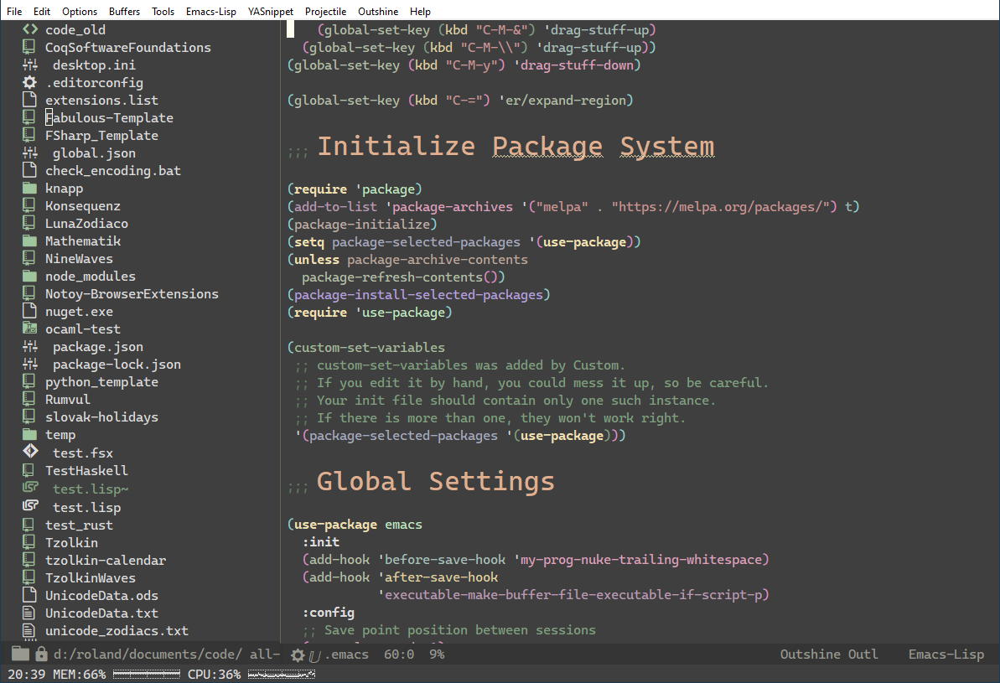

# Emacs

My *modern* ;) Emacs configuration. Uses use-package to configure the packages, and LSP for most programming modes, works under Linux and Windows. Uses keybindings for a slovak keyboard layout and sets a slovak calendar.

<!-- markdown-toc start - Don't edit this section. Run M-x markdown-toc-refresh-toc -->
**Table of Contents**

- [Emacs](#emacs)
    - [Files](#files)
    - [Usage](#usage)
        - [Hyper Key](#hyper-key)
        - [Fonts](#fonts)
        - [Coq configuration under Windows](#coq-configuration-under-windows)
        - [Hunspell](#hunspell)
        - [Installation of LSPs, formatters and linters](#installation-of-lsps-formatters-and-linters)
        - [Vterm](#vterm)
    - [License](#license)

<!-- markdown-toc end -->



Theme ist `doom-zenburn`, mode-line is `doom-modeline` and the treeview on the left is `dired-sidebar`. Outline in the `.emacs` Elisp file is by `outshine`, syntax highlighting uses `tree-sitter`, `rainbow-identifiers` and `rainbow-delimeters`. Time, memory and CPU usage displayed by `symon`.

## Files

- [~/.emacs](./.emacs) - The main Emacs configuration file
- [~/./.emacs.d/config/templates.el](./.emacs.d/config/templates.el) - File with templates for new, empty files. Change `YOUR NAME` to your name.
- [./.emacs.d/snippets/prog-mode/](./.emacs.d/snippets/prog-mode/) - YASnippets for all programming modes, so far only license headers. Change `YOUR NAME` to your name.

## Usage

Configures the following programming languages and DSLs:

- Coq, using `proof-general` and `company-coq`
- Common Lisp with `sly` as REPL and `paredit`
- Clojure with `cider` as REPL and `paredit`
- Shell / Bash with LSP (uses `shellcheck` if installed)
- C using LSP
- C++ using LSP
- F# using LSP
- Javascript using LSP
- Python using LSP (`pyright`)
- Typescript using LSP
- CSS using LSP
- SCSS using LSP
- HTML using LSP
- XML using LSP
- JSON using LSP
- Markdown using LSP
- YAML using LSP
- INI (no LSP)
- TOML (no LSP)

### Hyper Key

Uses the *Windows App key* as Hyper key. No configuration except in `.emacs` needed under Windows, under Linux you have to configure it using `xmodmap`

Edit `~/.xmodmaprc` like the following:

    ```shell
    keycode 135 = Hyper_R
    remove Mod4 = Hyper_L
    add Mod3 = Hyper_L
    ```
`135` is the keycode you get by calling `xev` and pressing the key.
`Mod4` contains `Hyper` too, so you have to remove Hyper from `Mod4` and add it to the empty `Mod3`. Check that by calling `xmodmap`.

### Fonts

Uses `Cascadia Code PL` as mono spaced font and `STIX Two Math` for special math characters like `∀` or `ℕ` (in Coq mode).
You can download these free fonts from their GitHub Releases:
- [Cascadia Code Download](https://github.com/microsoft/cascadia-code/releases/latest)
- [Stix Two Fonts Download](https://github.com/stipub/stixfonts/releases/latest)

Download both Zip-files, unzip them and install the TTF fonts for your OS, normally by right-clicking and selecting `Install` or `Install for All Users (Administrator)`.
From the Stix package you only need to install `/fonts/static_ttf/STIXTwoMath-Regular.ttf`, from Cascadia the `ttf/CascadiaCodePL*.ttf` files

### Coq configuration under Windows

Appends the following paths to get Coq and Proof General to work:

- `C:/Coq/bin` - the directory, where Coq is installed. [Latest binary release at GitHub](https://github.com/coq/platform/releases/latest)
- `C:/Program Files (x86)/GnuWin32/bin` - path to GNU diff [GNU DiffUtils for Windows](http://gnuwin32.sourceforge.net/packages/diffutils.htm)
- `C:/tools/msys64/usr/bin` - path to the directory Msys2 is installed in, [Msys2 Website](https://www.msys2.org/)

### Hunspell

Uses `hunspell` as spell checker for `flyspell`, so you have to install it under Linux and unzip it to this path under Windows:

- Windows path: `C:/ProgramData/hunspell/bin/hunspell.exe` - Download it from the EzWinPorts Sourceforge site: [EzWinPorts files at Sourceforge](https://sourceforge.net/projects/ezwinports/files/), package `hunspell-1.3.2-3-w32-bin.zip` [hunspell-1.3.2-3-w32-bin.zip](https://sourceforge.net/projects/ezwinports/files/hunspell-1.3.2-3-w32-bin.zip/download) and unzip it to this directory

### Installation of LSPs, formatters and linters

The LSP package tries to download the LSP packages itself, but to be safe.
All are installed globally, so you have to be root, administrator or use `sudo`.

- Bash LSP

    ```shell
    npm i -g bash-language-server
    ```

- Typescript LSP and typescript

    ```shell
    npm i -g typescript-language-server
    npm i -g typescript
    ```

- Eslint

    ```shell
    npm i -g eslint
    ```

- CSS LSP

    ```shell
    npm install -g vscode-css-languageserver-bin
    ```

- HTML LSP

    ```shell
    npm install -g vscode-html-languageserver-bin
    ```

- JSON LSP

    ```shell
    npm install -g vscode-json-languageserver
    ```

- Markdown LSP

    ```shell
    npm install -g unified-language-server
    ```

- YAML LSP

    ```shell
    npm install -g yaml-language-server
    ```

- Python LSP

    ```shell
    npm install -g pyright
    ```

- Black: `pip install black`

- Prettier

    ```shell
    npm install -g prettier
    ```

- Markdownlint

    ```shell
    npm install -g markdownlint-cli
    ```

- CLJ-Kondo

    ```shell
    npm install -g clj-kondo
    ```

### Vterm

Uses vterm under Linux, you need to install the following Ubuntu packages to be able to compile the Emacs package against Vterm:

```shell
sudo apt-get install libvterm-bin libvterm-dev libvterm0
```

## License

Licensed under the GPLv3 and later versions, see file [LICENSE](LICENSE)
